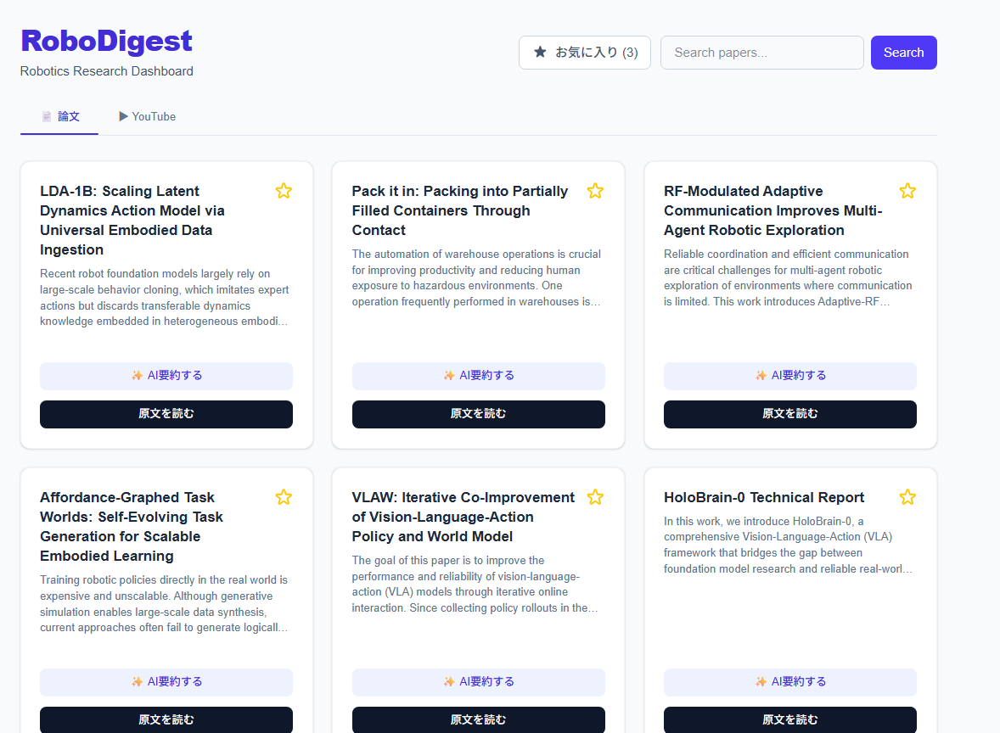

# RoboDigest

**RoboDigest** is a daily dashboard for robotics researchers and enthusiasts. It fetches the latest papers from arXiv (`cs.RO`) and trending YouTube videos, providing AI-powered summaries on demand to help you stay up-to-date with trends in ROS 2, logistics, warehouse automation, and simulation.



## Features

- **Daily Feed**: Automatically fetches the latest robotics papers from arXiv.
- **YouTube Integration**: Browse trending robotics videos from YouTube via the Data API v3.
- **Tab Switching**: Seamlessly switch between 📄 Papers and ▶ YouTube tabs.
- **Smart Search**: Filter papers or videos by keywords to find exactly what you're interested in.
- **AI Summarization**: Click "✨ AI要約する" to generate a concise 3-point summary in Japanese using Google Gemini 2.5.
- **Unified Bookmarks**: Save papers and videos to your favorites, viewable in a single list.
- **Responsive Design**: Modern, clean interface built with Tailwind CSS.

## Getting Started

### Prerequisites

- Node.js (v18+)
- Google Gemini API Key
- YouTube Data API v3 Key

### Installation

1.  Clone the repository:

    ```bash
    git clone https://github.com/iichanize/robo-digest.git
    cd robo-digest
    ```

2.  Install dependencies:

    ```bash
    npm install
    ```

3.  Set up environment variables:
    Create a `.env.local` file in the root directory:

    ```env
    GEMINI_API_KEY=your_gemini_api_key_here
    YOUTUBE_API_KEY=your_youtube_api_key_here
    ```

4.  Run the development server:

    ```bash
    npm run dev
    ```

5.  Open [http://localhost:3000](http://localhost:3000) in your browser.

## Tech Stack

- **Framework**: Next.js 16 (App Router)
- **Language**: TypeScript
- **Styling**: Tailwind CSS v4
- **AI**: Google Gemini API (`gemini-2.5-flash`)
- **Data Sources**: arXiv API, YouTube Data API v3

## License

MIT
